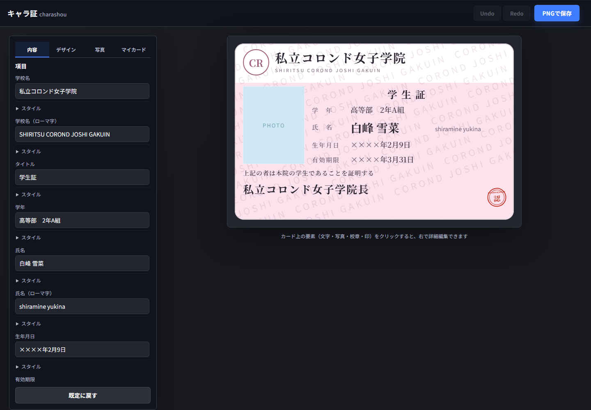
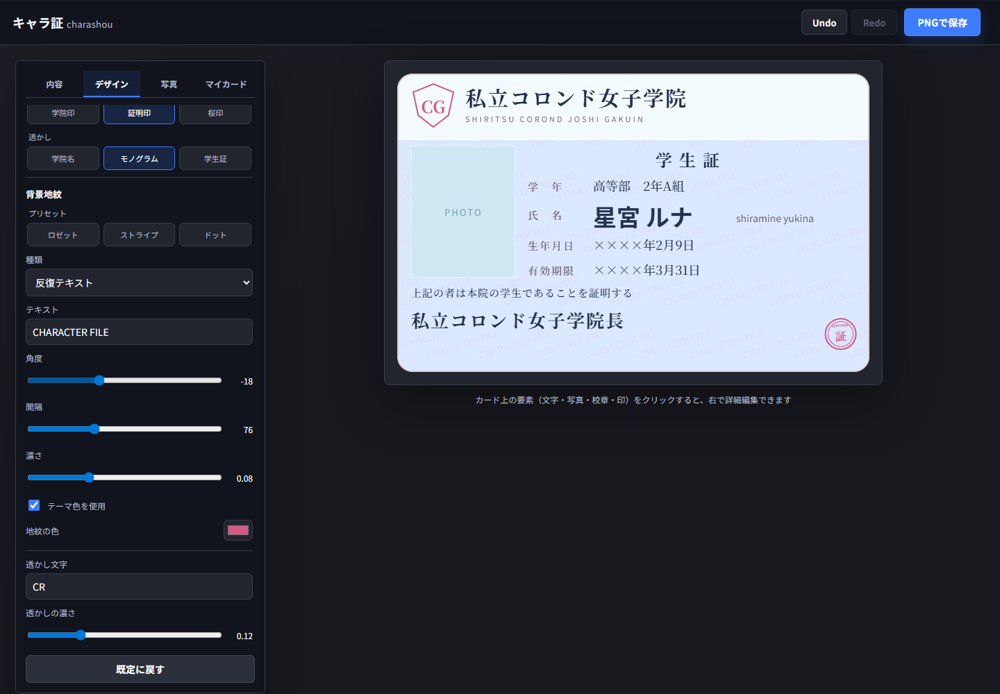
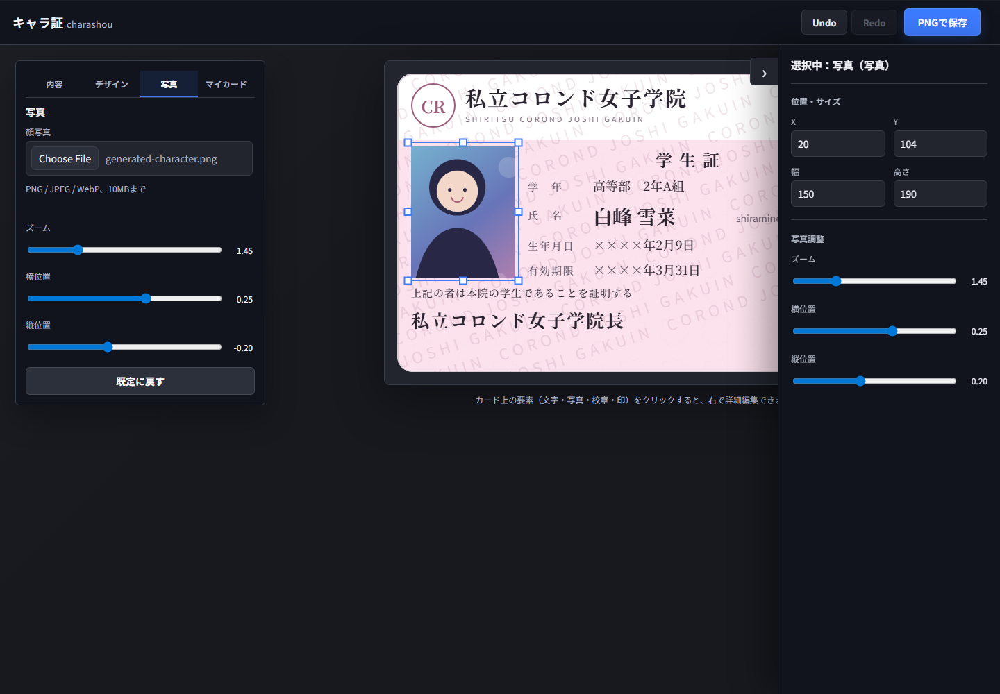
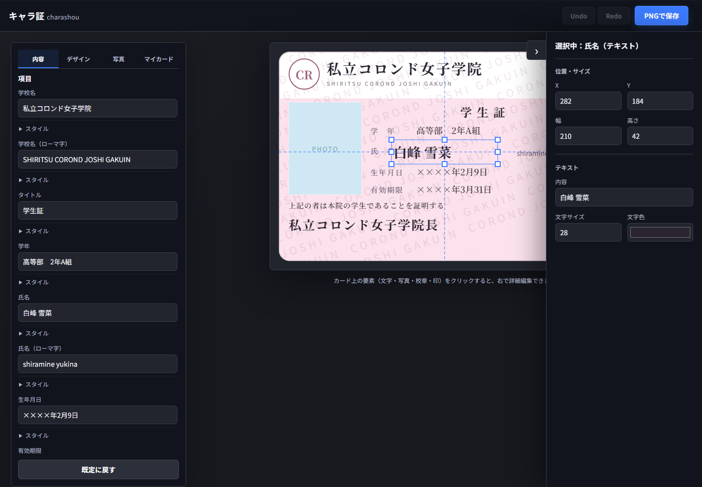
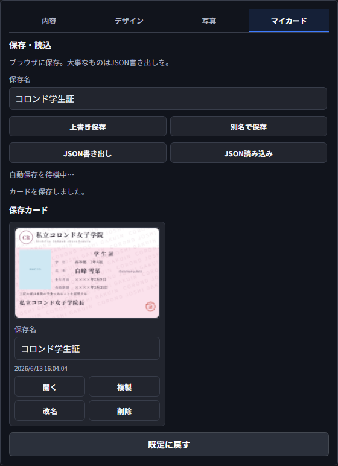

# キャラ証（charashou）

オリジナルキャラの**学生証/身分証風カード**を作るブラウザツール。
顔写真・名前・学校名・学年などを差し替えて、PNGで書き出せる。

> 作る人（同人/創作）が、**自分の絵（ComfyUI/イラスト）を載せて設定資料カードを作る**ための道具。
> （汎用「学生証メーカー」と違い、創作者の設定資料用途に寄せていく方針）

## スクリーンショット
Playwrightで自動生成した現状スクリーンショットです（レビュー／AI参照用）。機能追加後は `npm run shots` で固定ファイル名へ上書きします。

### 全体
「内容」タブを開いた既定状態の編集パネルとカードプレビュー。



### カスタマイズ
「デザイン」タブでシールド校章・丸印・透かしを選び、背景地紋を反復テキストとして角度・間隔・濃さまで調整した状態。



### 写真調整
「写真」タブで自前生成の架空キャラクター画像を入れ、写真選択時の右インスペクタからもズームと位置を調整できる状態。



### 自由配置エディタ
氏名要素のTransformer、カード中央へのスナップガイド、選択中テキストの右インスペクタ。



### プロパティパネル
「マイカード」タブの保存・JSON操作とサムネイルグリッド。



## 使い方
1. `npm install` → `npm run dev` で開発サーバを起動。
2. 左パネルの「内容／デザイン／写真」を切り替えて編集する。デザインでは校章・印・透かしのプリセットと、背景地紋の種類・文字・角度・間隔・濃さ・色などを調整できる。カード上の文字・写真・校章・印は右インスペクタやドラッグ／リサイズでも編集可能。
3. 作業内容はブラウザへ自動保存される。「マイカード」から名前付きカードとして保存するか、JSONでバックアップできる。
4. 「PNGで保存」で画像を書き出し（3倍解像度）。

ビルド確認：
```bash
npm run check
npm run build
npm run preview
```

UI/写真/PNG出力を触った時：
```bash
npm run check:e2e
```

レビュー用スクリーンショットを更新する時：
```bash
npm run shots
```

整形・lint：
```bash
npm run lint
npm run lint:fix
```

## 技術
- Vite ＋ React ＋ TypeScript（クライアント完結）
- react-konva / KonvaでCanvas描画→Blobベースの3倍PNG
- Dexie / IndexedDBで保存カード一覧と自動保存、ZodでJSON読込を検証
- Biome ＋ Vitest ＋ Playwright最小E2Eで品質と既存挙動を固定
- GitHub ActionsでCIとGitHub Pages配信
- フォント：Noto Serif JP / Noto Sans JP（Google Fonts）
- 仕組み：テンプレJSONの座標要素をKonva Stageへ描画。校章・印・透かし・背景地紋は保存可能な生成パラメータから手続き描画し、内容要素と右インスペクタも同じtemplate/photo stateを直接編集する。

### 注意（ハマりどころ）
- **日本語フォントは読み込み完了を待ってからKonvaを再描画・書き出し**（`await document.fonts.ready`）。待たないと明朝が反映されない。
- 外部URLの画像はCORSで出力できないことがある → 写真はアップロード（dataURL）でOK。
- 顔写真はPNG/JPEG/WebP、10MB以下。クロップ調整はパネルのズーム／横位置／縦位置sliderで行う。

## ロードマップ
最新の実装状況は `docs/STATUS.md` を参照。
- [x] テンプレJSON＋プロパティパネル＋全体テーマ
- [x] react-konva 化＋自由配置エディタ（選択/ドラッグ/リサイズ/スナップ/ガイド）
- [x] 写真のズーム/位置調整＋アップロード検証＋3倍PNG（toBlob）
- [x] レビュー用スクショ自動生成（`npm run shots`）＋CI/Pages配信
- [x] Undo/Redo（連続編集のcoalesce・ショートカット・50件上限）
- [x] IndexedDB保存カード一覧＋自動保存／復元＋JSONバックアップ
- [x] 左編集パネルのタブ化＋マイカードのサムネイルグリッド
- [x] text/写真/校章/印の選択追従右スライドインスペクタ
- [x] 校章／印／透かしのプリセット＋編集可能な背景地紋ジェネレーター
- [ ] 装飾生成の高度化＋素材アップロード管理
- [ ] 複数テンプレ（学園/魔法学校/ギルド/サイバー/VTuber…）＋テンプレ毎の項目＋切替
- [ ] 選択要素の情報表示/キーボード移動・SNS用書き出し・ビジュアル回帰テスト
- [ ] Boothで設定資料テンプレ配布

## メモ
- 設計の詳細：`SPEC.md`
- 検証ルール：`docs/validation.md`
- これは FTIVision とは**別プロジェクト**（独立リポジトリ）。
